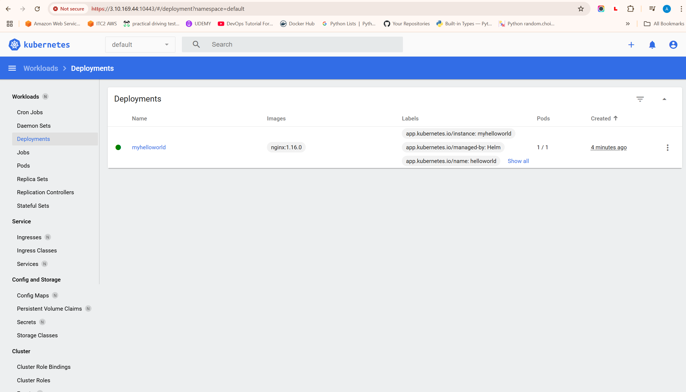

# Helm Charts

## Testing Env
- Let us host a mini kubernetes cluster using **micro k8s** <a href ="https://microk8s.io/docs">Link to Microk8s</a>
- sudo snap install microk8s --classic
- microk8s status --wait-ready 
- Ubuntu user wont have enough permission so add to microk8s group **sudo usermod -aG microk8s ubuntu**
- newgrp microk8s to reset group permissions.
- Install kubectl cli
```bash
curl -LO https://dl.k8s.io/release/v1.32.0/bin/linux/amd64/kubectl #x86 arch
sudo install -o root -g root -m 0755 kubectl /usr/local/bin/kubectl
chmod +x kubectl
mkdir -p ~/.local/bin
mv ./kubectl ~/.local/bin/kubectl
kubectl version --client
```
- MicroK8s Installation
```bash
sudo snap install microk8s --classic --channel=1.32
echo $HOME
cd $HOME
mkdir .kube
chmod 700 .kube
cd .kube
sudo usermod -aG microk8s ubuntu
newgrp microk8s
microk8s config > config
cat config #To check the kube config file
kubectl get all -A
```

## Installing Helm charts.
- To install Helm chart follow the <a href="https://helm.sh/docs/intro/install/">docs</a>
```bash
curl -fsSL -o get_helm.sh https://raw.githubusercontent.com/helm/helm/main/scripts/get-helm-3
chmod 700 get_helm.sh
./get_helm.sh
helm version
```

## What is Helm Chart Architecture
- Charts -> Helm Repo -> Helm along with Kubectl -> Kube-api-server(kube-dns, etcd, controller manager, scheduler) -> Nodes

## Helm Quick Start
- To create helm chart - "helm create nameoffolder"
- It should create a directory with Helm charts directory structure. To verify, cd into the directory and run "tree ."
```tree
.
├── Chart.yaml
├── charts
├── templates
│   ├── NOTES.txt
│   ├── _helpers.tpl
│   ├── deployment.yaml
│   ├── hpa.yaml
│   ├── ingress.yaml
│   ├── service.yaml
│   ├── serviceaccount.yaml
│   └── tests
│       └── test-connection.yaml
└── values.yaml
```
- This is how the directory structure will look like.
- **Chart.yaml**: Contains metadata like api version
- **charts**
- **templates**: Contains application specific kuberentes definition files
- **values.yaml**: Contains variables that will override values in templates.
- To deploy the helmchart "helm install nameofchart nameoffolder"
- To list the charts running inside the cluster "helm list -a"
- With microk8s we have a dashboard where we can view the kubernetes cluster in a dashboard, run the command **"microk8s dashboard-proxy"**
- You will get a https://IP:Port to access the dashboard and a token, Simply pass the token to login to the dashboard and view the workloads on microk8s cluster.
- DASHBOARD
- Now lets delete or uninstall the helm chart we deployed. run the command "helm uninstall nameofchart" 

## HELM COMMANDS
- helm create helloworld - Use this command to create helm folder with the name helloworld that has all the charts template. 
- helm install myhelloworld helloworld - Use this command to install a new helm chart with the name myhelloworld from the template of the helloworld. Initiallity it will have REVISION 1 
- helm list -a - To list all the helm charts deployed in the cluster
- helm upgrade myhelloworld helloworld - This will upgrade the helm chart with any new changes to the template files inside helloworld folder. This will have REVISION 2 and SEQUENTIALLY.
- helm rollback myhelloworld 1 - This will rollback the myhelloworld helmchart to REVISION 1 after ROLLBACK still the REVISION will increase SEQUENTIALLY. 
- helm install myhelloworld --debug --dry-run helloworld - This will give show any errors or misconfigurations in helm chart values by validating with Kuber-Api-Server. 
- helm template helloworld - This is a helm template, that simple validates all the yml templates inside helloworld helm directory
- helm lint helloworld - This will tell us if there are any errors or misconfiguration in helm chart folder helloworld. Similar to tflint in terraform.
- helm uninstall myhelloworld - This will delete or uninstall the helmchart myhelloworld so all pods and services will go down. We can make use of the directory helloworld still to recreate if required.

## Create custom helm charts
- I have created a simple flask app using python, that is accessible at http://localhost:9001
- Now I will containerize this flask app using dockerfile.
- I will push this to my docker hub as public image with name adityahub2255/python-helm
```bash
docker build -t adityahub2255/python-helm .
push adityahub2255/python-helm
```
- helm create pythonapp - To create a working directory of helm with template files and helm tree structure.
- vi pythonapp/chart.yml - Comment out the app version as we wont be using it. As api version will add image versions automatically next to image because of this "image: "{{ .Values.image.repository }}:{{ .Values.image.tag | default .Chart.AppVersion }}""
```yaml
#appVersion: "1.16.0"
```
- vi pythonapp/values.yml - To modify some values to change image name
```yaml
image:
  repository: adityahub2255/python-helm:latest

service:
  type: NodePort
  port: 9001

#livenessProbe:
# httpGet:
#   path: /
#   port: http
#readinessProbe:
# httpGet:
#   path: /
#   port: http
# or change
livenessProbe:
httpGet:
  path: /hello
  port: http
readinessProbe:
httpGet:
  path: /hello
  port: http
```
- vi pythonapp/templates/deployment.yml
```yaml
containers:
    image: "{{ .Values.image.repository }}" # removed app version

    ports:
    - name: http
        containerPort: {{ .Values.service.port }}
        protocol: TCP
# IF YOU COMMENTED LIVENESS AND READINESS PROBE COMMENT THESE VALUES, IF YOU ADDED /HELLO DONT COMMENT THESE PARTS.
    #  {{- with .Values.livenessProbe }}
    #livenessProbe:
    #{{- toYaml . | nindent 12 }}
    #{{- end }}
    #{{- with .Values.readinessProbe }}
    #readinessProbe:
    #{{- toYaml . | nindent 12 }}
    #{{- end }}
    #{{- with .Values.resources }}
```
- helm lint pythonapp
- helm install flaskapp pythonapp
- helm uninstall flaskapp

## HELMFILE
- What is helm file why we need it? Helps manage helm charts even better than helm CLI commands
- For example a single command "helmfile sync" will do both installing "helm install flaskapp python" and uninstalling helm charts "helm uninstall flaskapp"
- How? It maintains a helmfile 
```yaml
releases:
  - name: flaskapp # chart name
    chart: pythonapp # name of folder
    installed: true # set true to install false to uninstall
```
- Installing <a href="https://github.com/roboll/helmfile/releases">helm file</a>
```bash
cd $HOME
wget https://github.com/roboll/helmfile/releases/download/v0.144.0/helmfile_linux_amd64
mv helmfile_linux_amd64 helmfile
chmod 700 helmfile 
sudo mv helmfile /usr/local/bin
helmfile -version # verify installation
```
- We can reuse the python workdir
```bash
cp -r pythonapp /helmfile
cat << EOF > helmfile.yml
releases:
  - name: flaskapp # chart name
    chart: pythonapp # name of folder
    installed: true # set true to install false to uninstall
EOF
helmfile -f helmfile.yml sync # Will deploy/install the chart
```
- This should create the deployment
```bash
sed -i 's/installed: true/installed: false/g' helmfile.yml
helmfile -f helmfile.yml sync # Will delete/uninstall the chart
```
- helmfile can take the helm package from git repo as well, we need **helm-git** tool to connect helm with git. <a href="https://github.com/aslafy-z/helm-git">Helm-git Plugin</a>
```bash
helm plugin install https://github.com/aslafy-z/helm-git --version 1.3.0
```
- To package and publish Helm charts to GitHub Repo, First enable pages in GitHub Repository settings.
- Now, In helm charts we have an important file called **index.html**. <a href="https://helm.sh/docs/topics/chart_repository/">More info</a>.
- Follow these steps to create helm package
```bash
cp -r pythonapp helmpackage
cd helmpackage
└── pythonapp
    ├── Chart.yaml
    ├── charts
    ├── templates
    │   ├── NOTES.txt
    │   ├── _helpers.tpl
    │   ├── deployment.yaml
    │   ├── hpa.yaml
    │   ├── ingress.yaml
    │   ├── service.yaml
    │   ├── serviceaccount.yaml
    │   └── tests
    │       └── test-connection.yaml
    └── values.yaml
helm package pythonapp
# From github repo, after pages is setup get the URL
https://aditya1234556.github.io/Terraform-Terragrunt/
# This will create an index.html file
git clone https://github.com/ADITYA1234556/Terraform-Terragrunt.git
mv index.html pythonapp-0.1.0.tgz Terraform-Terragrunt/HELM/helmpackage/
helm repo add mychartrepo https://aditya1234556.github.io/Terraform-Terragrunt/
helm repo list -A
```


## HELM REPOS
- Helm has repo database
- We can search for repo using, **helm search hub wordpress**
- To add third party repo, 
```bash
helm repo add bitnami https://charts.bitnami.com/bitnami
helm show readme bitnami/wordpress #--version 10.0.3
helm show values bitnami/wordpress #--version 10.0.3
```
- To add our applicaiton package, 
