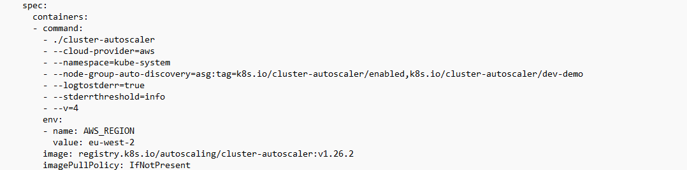

# KUBERNETES ADD-ONS MODULE
- This Module is responsible for Kuberentes Add-Ons to the EKS cluster
- These add-ons like **cluster auto scaler**, **csi storage drivers**, **loadbalancer controllers**, etc.
- We will deploy these add-ons as helm charts.

## Troubleshooting
- After deploying my autoscaler add on, I was expecting my autoscaler add on to increase the number of nodes based on load.
- But my auto scaler was unable to increase the number of nodes.
- Upon inspecting the helm chart deployment of autoscaler, kubectl edit deploy -n kube-system autoscaler
- I found that my autoscaler config was pointing to a different region from where my eks cluster was at. 
- I changed the region value to point to the same region as my eks cluster and it was resolved.
- Image 